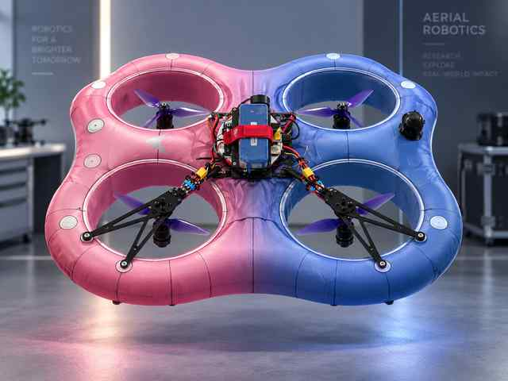

<div align="center">

# Soft Drone Controller

**ROS 2 control stack for a soft ducted quadrotor**

<p>
  
  
  
  
</p>



</div>

## Overview

`soft_drone_controller` is a ROS 2 controller for an experimental soft ducted quadrotor. The stack combines **quaternion attitude PID**, **position hold / path control**, and **EtherCAT + DShot** motor output for real-flight experiments.

Main nodes include `drone_controller`, `position_control`, `position_cmd`, and `send_target`.

## Demo

<div align="center">
  
  <br>
  <sub>Demo video coming soon · upload docs/assets/demo.mov or demo.mp4</sub>
</div>

## Quick Start

```bash
source /opt/ros/humble/setup.bash
colcon build --symlink-install
source install/setup.bash
ros2 launch soft_drone_controller controller_launch.py
```

---

<div align="center">
  <sub>Soft Robotics · Aerial Robotics · ROS 2 · EtherCAT</sub>
</div>
